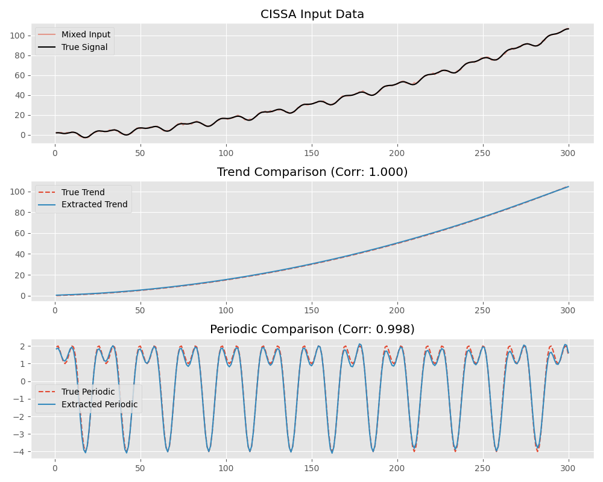

# CISSA Accuracy Evaluation

This example demonstrates how to evaluate the accuracy of univariate CISSA using a synthetic dataset with known ground truth components (trend, periodic, and noise).

We utilize standard metrics such as Mean Squared Error (MSE) and Pearson Correlation to verify how closely the extracted `x_trend` and `x_periodic` match the theoretical true signals.

## Running the Example

Run the Python script located in this directory:

```bash
python accuracy_evaluation.py
```

## Results

CISSA is able to perfectly extract the trend (Corr: 1.000) and highly accurately extract the periodic components (Corr: 0.998) despite the presence of noise.


