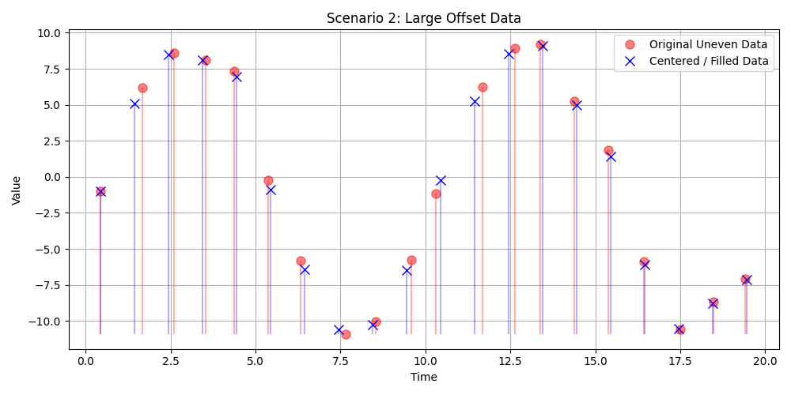
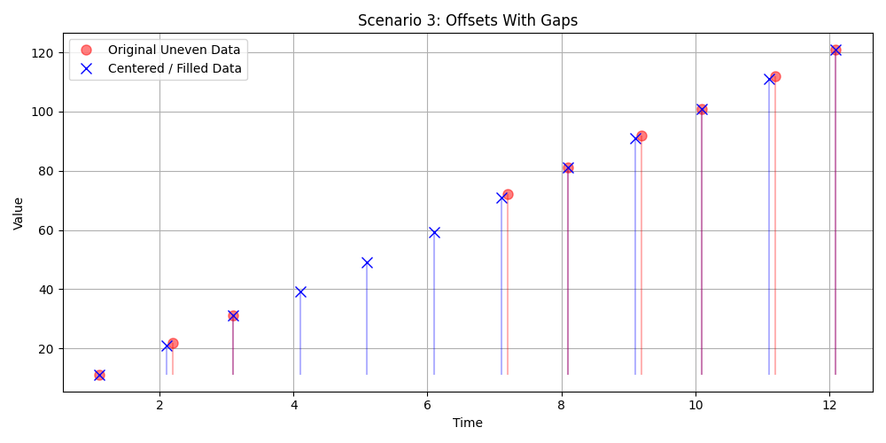

# Centering Uneven Data to an Evenly Spaced Grid

Many real-world time series datasets suffer from timing irregularities. For robust analysis, especially when running CISSA methods which require evenly spaced grids, it is essential to align ("center") unevenly measured data points onto a fixed interval grid.

`pycissa` provides a convenient method directly attached to the `Cissa` object: `pre_fill_uneven_timeseries()`.

By enabling `center_data=True`, the method will execute the interpolation and filling algorithm, and fully replace the internal time points `self.t` and values `self.x` with the perfectly spaced and interpolated (or gap-filled) data. The `Cissa` object carries this data forward for further analysis methods like `auto_cissa()`.

Below are three examples demonstrating how `pre_fill_uneven_timeseries(center_data=True)` handles different types of timing irregularities.

## 1. Slightly Offset Data
In this scenario, we have an underlying signal sampled at approximately correct intervals, but each measurement has a slight random timing jitter. Setting `center_data=True` flawlessly snaps the data points onto the desired grid frequency (`dt=1.0`).

```python
import numpy as np
from pycissa import Cissa

# Generate data with slight offsets
np.random.seed(42)
perfect_t = np.arange(0, 20)
t = perfect_t + np.random.uniform(-0.2, 0.2, size=len(perfect_t))
x = 10 * np.sin(2 * np.pi * perfect_t / 10) + np.random.normal(0, 1, size=len(perfect_t))

cissa = Cissa(t, x)

# Interpolate and snap to a 1.0 step grid
cissa.pre_fill_uneven_timeseries(
    L_values=[5],
    dt=1.0,
    gap_threshold=0.6,
    center_data=True, # Critical parameter
    plot=False,
    outliers=['nan_only', None]
)
```


## 2. Large Offset Data
If your timing offset is large, you may need to increase the `gap_threshold` parameter. The threshold defines how far a target grid point can be from a genuine measurement before it is classified as a "gap" (missing value). If the gap threshold is sufficiently large to encapsulate the large jitter, the function will directly interpolate the nearest neighbors onto the grid point without invoking the CISSA gap-filling recovery algorithm.

```python
# Add large random offsets
t = perfect_t + np.random.uniform(0.3, 0.7, size=len(perfect_t))
x = 10 * np.sin(2 * np.pi * perfect_t / 10) + np.random.normal(0, 1, size=len(perfect_t))

cissa = Cissa(t, x)
cissa.pre_fill_uneven_timeseries(
    L_values=[5],
    dt=1.0,
    gap_threshold=0.8, # Increased to handle larger offset
    center_data=True,
    plot=False,
    outliers=['nan_only', None]
)
```




## 3. Offsets with Gaps
In cases where data contains both timing jitter and entirely missing blocks of data, a strict `gap_threshold` causes the evenly-spaced grid points falling inside the "missing" block to be correctly flagged as `NaN`. `pre_fill_uneven_timeseries` then executes the iterative CISSA gap filling optimization to synthesize and impute values for these unmeasured intervals.

Because `center_data=True` is provided, the resultant `Cissa` object emerges with a fully even grid containing both snapped measurements and recovered gap signals smoothly blended together.

```python
# Data featuring both timing offsets and missing gaps
t = np.array([1.1, 2.2, 3.1, 7.2, 8.1, 9.2, 10.1, 11.2, 12.1])
x = np.array([11.0, 22.0, 31.0, 72.0, 81.0, 92.0, 101.0, 112.0, 121.0])

cissa = Cissa(t, x)

cissa.pre_fill_uneven_timeseries(
    L_values=[3],
    dt=1.0,
    gap_threshold=0.5, # Strict threshold forces gaps
    center_data=True,
    plot=False,
    outliers=['nan_only', None]
)
```


