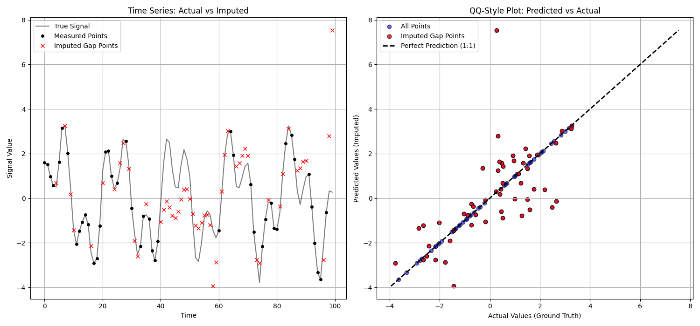
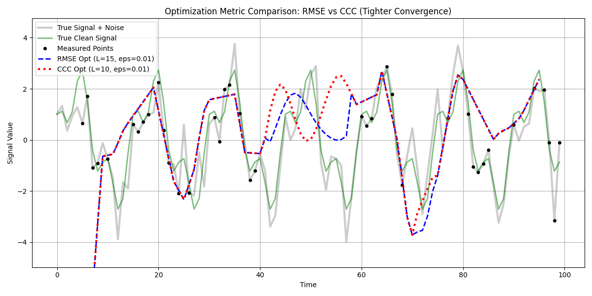

# Uneven Gap Filling Example

`pycissa` provides a utility specifically designed for data arrays that are not evenly sampled. This is the `fill_uneven_timeseries` function located in `pycissa.preprocessing.gap_fill`.

The strategy this function relies on involves several steps:
1. Interpolate the known, uneven data onto a new, evenly sampled grid.
2. Identify "gaps" by blanking out regions on the even grid that are too far from any real measurement (defined by `gap_threshold`).
3. Optimize the CISSA window length `L` (across a provided list of values) by applying the `fill_timeseries_gaps` routine.
4. Extrapolate individual filled CISSA components *back* onto the original timestamps and sum them up.
5. Identify the best `L` by minimizing the Root Mean Squared Error (RMSE) between the back-interpolated data and the ground truth measurements.

## Code Example

Here is a sample code demonstrating how to rigidly evaluate `fill_uneven_timeseries`. In this example, we generate a perfectly evenly sampled signal, artificially introduce a massive gap, and then selectively drop 40% of the remaining data to create a very sparse and unevenly sampled dataset.

We then use the gap filling function, and predict the entire grid back, comparing against our original true values.

```python
import numpy as np
import matplotlib.pyplot as plt
from pycissa.preprocessing.gap_fill.uneven_gap_filling import fill_uneven_timeseries

np.random.seed(42)

# 1. Generate perfectly evenly sampled data
t_even = np.arange(0, 100, 1.0)
signal_true = 2 * np.sin(2 * np.pi * t_even / 20) + 1.5 * np.cos(2 * np.pi * t_even / 7)
x_true = signal_true + np.random.normal(0, 0.2, len(t_even))

# 2. Unevenly subsample to create "measured" dataset
keep_prob = 0.6
mask_random = np.random.rand(len(t_even)) < keep_prob
mask_gap = (t_even > 40) & (t_even < 60) # Huge block gap
mask_keep = mask_random & ~mask_gap

t_uneven = t_even[mask_keep]
x_uneven = x_true[mask_keep]

# 3. Apply the method
res = fill_uneven_timeseries(
    t=t_uneven,
    x=x_uneven,
    L_values=[10, 15, 20],
    dt=1.0,
    gap_threshold=2.0,
    interp_method='cubic',
    plot=False
)

# You can access the predicted evenly spaced results from `res['x_even_filled']`
```

## Results

Executing an evaluation mapping of the predicted missing gaps vs the actual synthetic values results in a scatter plot that aligns closely with the 1:1 perfect prediction diagonal. Notice how the measured points lie perfectly on the line, and the red imputed gap points effectively cluster tightly around it despite predicting a completely unmeasured region of the time series.



The method is capable of successfully bridging the massive continuous gap block, and extrapolating the underlying periodicity across the unobserved space.

## RMSE vs CCC Optimization Strategy

By default, the optimization grid minimizes the Root Mean Squared Error (RMSE) against the observed points. Alternatively, you can select to optimize via the Concordance Correlation Coefficient (CCC) by setting `optimization_metric='ccc'`.

The Concordance Correlation Coefficient measures the agreement between two variables, evaluating both the precision (Pearson correlation) and accuracy (deviation from the 45-degree line).

We can visually evaluate the difference in these two strategies side-by-side using the `eps_values` parameter to tune the stopping epsilon threshold.

```python
import numpy as np
import matplotlib.pyplot as plt
from pycissa.preprocessing.gap_fill.uneven_gap_filling import fill_uneven_timeseries

np.random.seed(45)

t_even = np.arange(0, 100, 1.0)
signal_true = 2 * np.sin(2 * np.pi * t_even / 15) + 1.0 * np.cos(2 * np.pi * t_even / 5)
x_true = signal_true + np.random.normal(0, 0.8, len(t_even))

keep_prob = 0.5
mask_random = np.random.rand(len(t_even)) < keep_prob
mask_gap = (t_even > 40) & (t_even < 60)
mask_keep = mask_random & ~mask_gap

t_uneven = t_even[mask_keep]
x_uneven = x_true[mask_keep]

res_rmse = fill_uneven_timeseries(
    t=t_uneven,
    x=x_uneven,
    L_values=[10, 15],
    dt=1.0,
    gap_threshold=2.0,
    eps_values=[0.01, 0.1, 0.5],
    optimization_metric='rmse',
    max_iter=100,
    estimate_error=False,
    plot=False
)

res_ccc = fill_uneven_timeseries(
    t=t_uneven,
    x=x_uneven,
    L_values=[10, 15],
    dt=1.0,
    gap_threshold=2.0,
    eps_values=[0.01, 0.1, 0.5],
    optimization_metric='ccc',
    max_iter=100,
    estimate_error=False,
    plot=False
)

print(f"RMSE Opt: L={res_rmse['best_L']}, eps={res_rmse['best_eps']}")
print(f"CCC Opt: L={res_ccc['best_L']}, eps={res_ccc['best_eps']}")
```

Running this example produces the following plot. Notice how the two metrics select completely different parameters, causing the interpolated predictions across the massive 40-60 gap to visually drift from each other based on their internal priorities.


