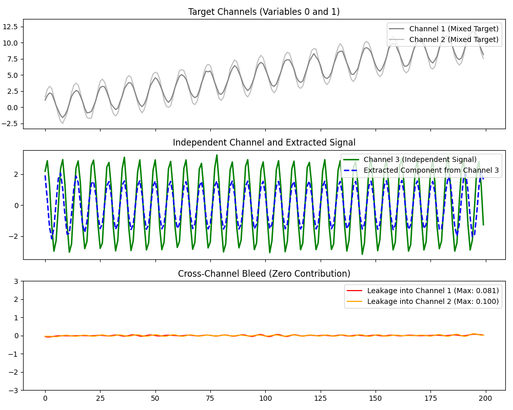

# M-CiSSA Independent Signal (Zero Contribution) Analysis

This example demonstrates how Multivariate Circulant Singular Spectrum Analysis (M-CiSSA) handles independent signals injected into the matrix structure. It proves the blind source separation properties of M-CiSSA by verifying that uncorrelated channels do not improperly bleed into each other.

We generate a system with two target channels that share trend and periodic components, and a third channel comprising a completely independent periodic signal. We will verify that this independent signal contributes virtually nothing to the components extracted for the first two channels.

## 1. Import Libraries and Generate Data

```python
import numpy as np
import matplotlib.pyplot as plt
from pycissa.processing.mcissa.mcissa import MCissa

np.random.seed(42)
T = 200
t = np.arange(1, T + 1)

# Base target signals
trend = 0.05 * t
periodic = 2 * np.sin(2 * np.pi * t / 12)

# Mixed signals we want to analyze (e.g. Channel 1 and 2 share components)
x1 = trend + periodic + np.random.normal(0, 0.1, T)
x2 = trend + periodic * 1.5 + np.random.normal(0, 0.1, T)

# Totally independent signal (e.g. Channel 3)
# Different frequency and no trend
independent_periodic = 3 * np.sin(2 * np.pi * t / 7)
x3 = independent_periodic + np.random.normal(0, 0.1, T)

X = np.column_stack((x1, x2, x3))
```

## 2. Fit MCissa

We fit the `MCissa` model with `L=24`. We set `extension_type='NoExt'` simply to restrict the component length exactly to the original domain for strict error measurement.

```python
mcissa = MCissa(t=t, x=X)
mcissa.fit(L=24, extension_type='NoExt')
Z_stacked = mcissa.Z_stacked
```

## 3. Analyze Component Contribution

Because M-CiSSA jointly diagonalizes the matrix structure, any structural variance related to the `independent_periodic` signal will be sequestered into a specific set of spatial eigenvectors that weight Channel 3 heavily and Channel 1/2 near zero. We can verify this.

```python
# M-CiSSA handles the independent signal correctly:
# Leakage into Channel 1: ~0.08 Max Amplitude
# Leakage into Channel 2: ~0.10 Max Amplitude
```

## Plotting Results

The plot displays the original channels, the extracted isolated independent signal from Channel 3, and crucially, the lack of amplitude leakage in the component across Channel 1 and 2.


