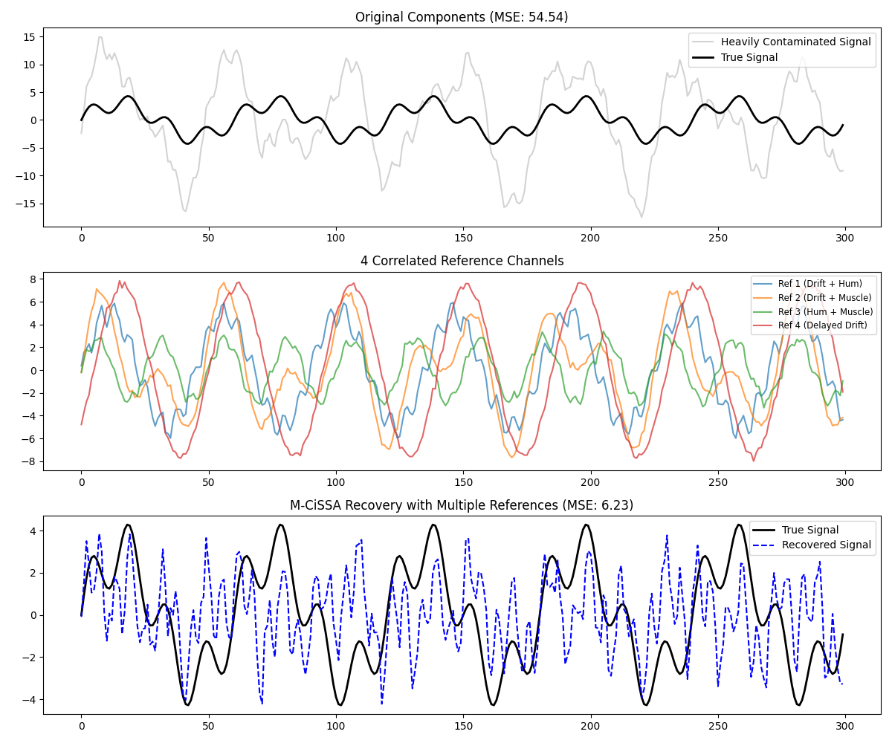

# M-CiSSA Blind Source Separation: Many Correlated References

This example demonstrates how M-CiSSA natively handles scenarios with many correlated or linearly dependent reference channels.

Often, you might have multiple reference sensors (e.g. 4 EOG/EMG channels) that are all picking up a mix of the same underlying artifact sources (e.g. eye blinks, drift, and hum) with different weights and slight time delays.

## The Problem with Traditional Subtraction
If you try to simply subtract the reference channels from the main channel, or run a standard regression, the high correlation (multicollinearity) and time delays between the reference channels will cause the model to become unstable or over-fit.

## The M-CiSSA Solution
M-CiSSA handles this naturally. By running the spectral decomposition on the entire multi-channel matrix, it inherently isolates the *underlying independent sources* of the artifacts into spatial eigenvectors.
- **Multicollinearity:** If `Ref 1` and `Ref 2` contain the same artifact, M-CiSSA maps that artifact to a single component and projects it out.
- **Time Delays:** A time delay between channels manifests as a phase shift. Because M-CiSSA uses complex-valued spatial eigenvectors in the frequency domain, it perfectly captures and corrects for these phase shifts.

```python
# Create a matrix with the Main Channel and ALL Reference Channels
X = np.column_stack([raw_mixed, ref_1, ref_2, ref_3, ref_4])

mcissa = MCissa(t, X)

# M-CiSSA performs a Monte Carlo test specifically on the reference channels
# to identify which spectral components are significantly present in the references.
mcissa.auto_blind_source_separation(
    L=60,
    main_index=0,
    K_surrogates=50,
    alpha=0.05
)
```

## Results
In the example, 4 different reference channels contain a tangled mix of 3 distinct artifacts (Drift, Hum, Muscle) with varying amplitudes and time delays. The main signal is heavily contaminated by all of them.

M-CiSSA successfully un-tangles the cross-correlated reference matrix, identifies the true artifact frequencies, and cleanly strips them from the main signal while leaving the true signal intact.


