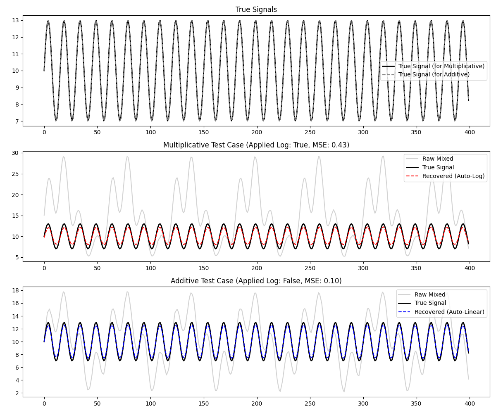

# M-CiSSA Blind Source Separation: Multiplicative vs Additive Noise

This example demonstrates how to automatically detect if an artifact is multiplicative and apply a log-transform using the `MultiplicativeTransformer` before running M-CiSSA.

M-CiSSA is inherently a linear algorithm designed for additive mixtures. When an artifact modulates the amplitude (variance) of the main signal rather than just shifting the mean, it is multiplicative. If we run linear M-CiSSA on a multiplicative mixture, it will fail to completely decouple the signals.

However, we can linearize a multiplicative mixture by taking the logarithm:
`log(Signal * Artifact) = log(Signal) + log(Artifact)`

After separation, we simply exponentiate the cleaned component.

## Automated Detection (Variance Correlation Test)

To detect if an artifact is multiplicative, we can check if the reference channel correlates with the **variance (or envelope)** of the mixed signal, rather than just the raw values.

The `test_if_multiplicative` utility function calculates a rolling standard deviation of the mixed signal and checks its Pearson correlation against the reference channel.

```python
from pycissa.preprocessing import test_if_multiplicative, MultiplicativeTransformer

is_mult, corr_raw, corr_std = test_if_multiplicative(mixed_signal, reference)
```

## The MultiplicativeTransformer

If the test indicates a multiplicative mixture, you can use the `MultiplicativeTransformer` to safely apply the log-transform. It automatically calculates and stores any necessary positive offsets so that negative values do not result in `NaN` during the `log()` operation.

```python
transformer = MultiplicativeTransformer()

# 1. Transform the data before creating the MCissa object
X_trans = transformer.fit_transform(X)

mcissa = MCissa(t, X_trans)
mcissa.auto_blind_source_separation()

# 2. Inverse the transform on the cleaned component
recovered = transformer.inverse_transform(mcissa.x_cleaned, col_idx=0)
```

## Results

In the example script, we construct two test cases:
1. **Multiplicative Test Case:** The true signal's amplitude is modulated by the artifact.
2. **Additive Test Case:** The artifact is simply added to the true signal.

The script automatically detects the nature of the mixing and applies the transformation (Log vs Linear) before running M-CiSSA.


