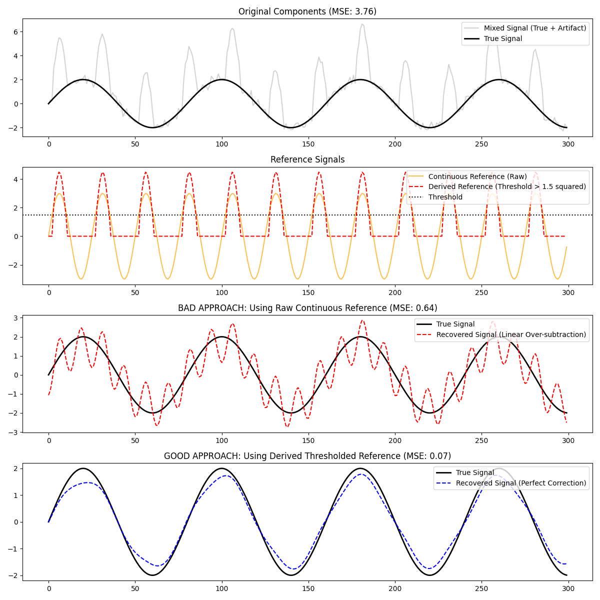

# M-CiSSA Blind Source Separation: Thresholded Artifacts

This example demonstrates how to handle non-linear thresholded artifacts with M-CiSSA.

M-CiSSA is inherently a linear algorithm. It finds the optimal linear combinations and spectral overlap between signals. If an artifact only occurs when a physical reference (like pressure, temperature, or voltage) exceeds a certain threshold, passing the raw continuous reference directly to M-CiSSA will often result in **over-subtraction**. The algorithm will try to fit and subtract those frequencies even during periods where the artifact does not physically manifest in the main signal.

## The Solution: Derived Reference Channels

To correctly separate thresholded artifacts, we must pre-process the reference channel into a **derived reference** that matches the physical reality of the artifact.

If we know (or suspect) the artifact only occurs above a threshold and has a non-linear relationship, we apply those transformations to the reference *before* running M-CiSSA.

### The Bad Approach (Raw Reference)
```python
# M-CiSSA linearly fits the frequencies across the entire timeseries,
# causing over-subtraction where the artifact doesn't exist.
X_bad = np.column_stack([raw_mixed, continuous_ref])
```

### The Good Approach (Derived Reference)
```python
# We derive a non-linear reference channel that matches the artifact.
derived_ref = np.zeros(T)
derived_ref[continuous_ref > threshold] = continuous_ref[continuous_ref > threshold]**2 * 0.5

X_good = np.column_stack([raw_mixed, derived_ref])
```

By explicitly providing M-CiSSA with the non-linear, thresholded morphology, it can perfectly map and separate the artifact without touching the clean periods of the main signal.


