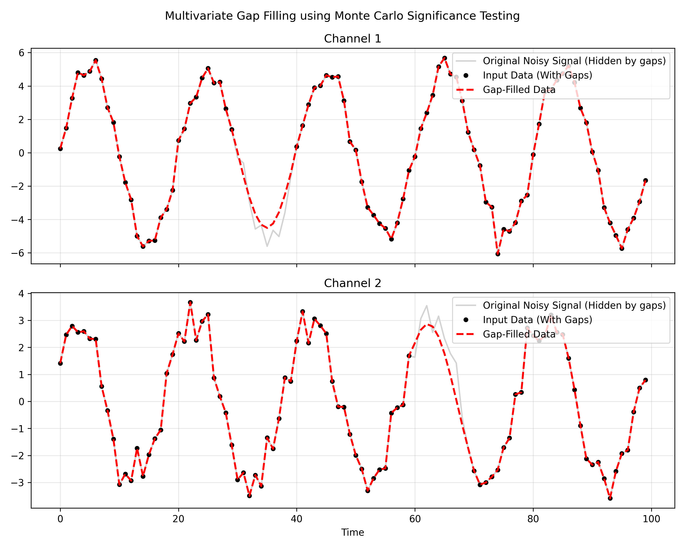

# Multivariate Gap Filling with Monte Carlo Significance

This example demonstrates how to use the `monte_carlo_significant_components` selection method within the `MCissa` preprocessing gap-filling pipeline.

## The Problem
When dealing with missing data (gaps) in multivariate time series, iterative spectral interpolation is often used. At each iteration, the algorithm decomposes the signal and drops "noise" components, retaining only the dominant periodic signals and trends to interpolate across the gap.

Historically, this selection was done using a fixed variance threshold (e.g., retaining 95% of the variance). However, fixed thresholds can accidentally retain noise or drop subtle but real signals depending on the signal-to-noise ratio.

## The Solution
By setting `component_selection_method='monte_carlo_significant_components'`, the gap-filling algorithm dynamically evaluates which spectral components are statistically significant at a chosen `alpha` level (e.g., `alpha=0.05` for 95% confidence). It generates phase-randomized (or permuted) surrogates of the mixture and tests the true cross-spectral density against the surrogate distribution.

Only components that pass this rigorous statistical test are used to build the iterative gap-filling bridge, preventing noise from corrupting the imputed values.

## Running the Example

Run the script to generate synthetic data with gaps, fill them using MCiSSA, and produce a plot:

```bash
poetry run python examples/example_m_gap_fill_monte_carlo.py
```

## The Output
The script will output a plot (`m_gap_fill_monte_carlo_plot.png`) showing:
1. The black dots representing the raw input data (with visible gaps).
2. The red dashed line representing the continuous time series after iterative interpolation driven by true statistically significant components.



Because the method uses true Monte Carlo testing under the hood, it is highly robust to varying noise floors across the channels, ensuring only the true shared dynamics are used to reconstruct missing data.
