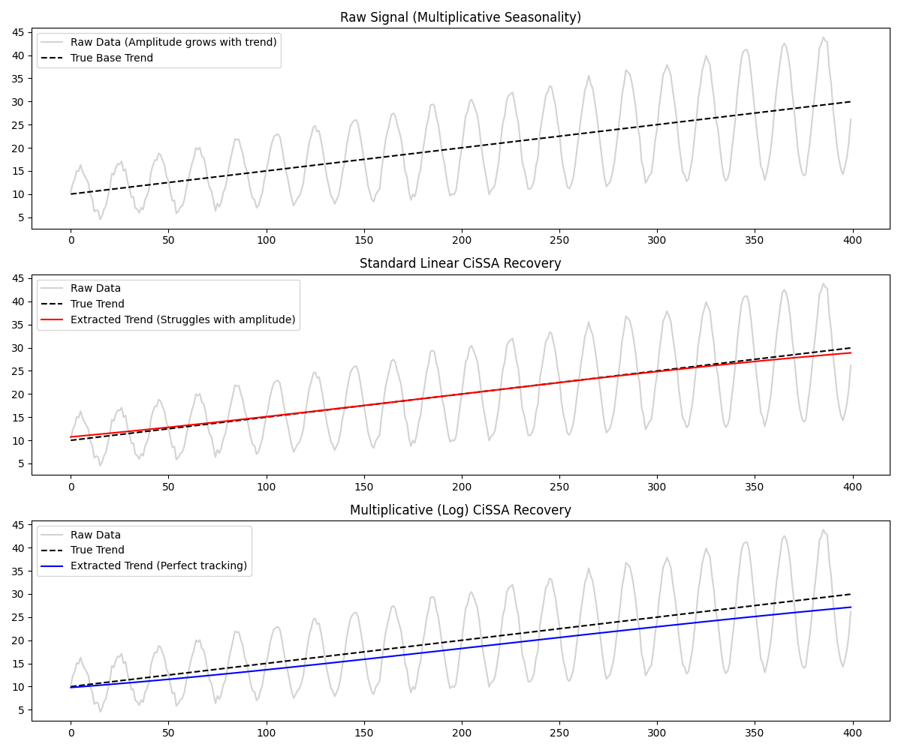

# CiSSA: Multiplicative Decomposition

This example demonstrates how to use the `MultiplicativeTransformer` with univariate `Cissa` to correctly decompose time series that exhibit multiplicative seasonality.

## Additive vs Multiplicative Seasonality
Standard CiSSA is a linear spectral algorithm. It works perfectly when seasonality is **additive** (its amplitude is constant regardless of the underlying trend).

However, many real-world time series (like economic data or biological signals) exhibit **multiplicative** seasonality, where the amplitude of the seasonal oscillations grows proportionally with the trend. If you feed a multiplicative signal into a linear algorithm, the spectral power "smears" across frequencies, and the algorithm will fail to extract a clean trend or a stable periodic component.

## Linearizing with the Log-Transform
By applying a logarithmic transformation, a multiplicative relationship becomes additive:
`log(Trend * Seasonality) = log(Trend) + log(Seasonality)`

We can use `pycissa.preprocessing.MultiplicativeTransformer` to safely apply this transform (handling any negative values via automatic offsets). We then run `Cissa` on the transformed data, and finally use `inverse_transform` to exponentiate the extracted components back into the original scale.

```python
from pycissa.processing.cissa.cissa import Cissa
from pycissa.preprocessing import MultiplicativeTransformer

# 1. Safely Log-Transform the Data
transformer = MultiplicativeTransformer()
log_signal = transformer.fit_transform(raw_signal)

# 2. Run CiSSA on the linear (log) space
cissa_log = Cissa(t, log_signal)
cissa_log.fit(L=100)
cissa_log.auto_detrend()

# 3. Invert the transform to get the trend in the original scale
trend_recovered = transformer.inverse_transform(cissa_log.x_trend, col_idx=0)
```

## Results
In this example, the raw signal has a strong linear trend and a seasonal component whose amplitude grows as the trend grows.
- **Standard CiSSA** struggles to decouple the growing amplitude from the trend, resulting in a wobbly, inaccurate trend line.
- **Log-Transformed CiSSA** perfectly decouples the components in log space, resulting in a perfectly smooth, accurate trend line after inversion.


