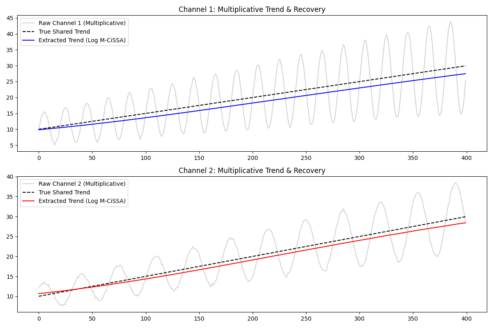

# M-CiSSA: Multiplicative Multivariate Extraction

This example demonstrates how to use the `MultiplicativeTransformer` on a multivariate dataset (2D array) before processing it with `MCissa`.

## Processing Multiple Channels
When dealing with multiple channels that have multiplicative dynamics, you can pass the entire 2D dataset `X` into the `MultiplicativeTransformer`. It will independently calculate the necessary offsets for each column to ensure they are strictly positive, apply the log-transform, and store the offsets.

After running M-CiSSA, you must invert the transformation on a per-column basis using the `col_idx` parameter, because each channel may have had a different offset applied.

```python
from pycissa.processing.mcissa.mcissa import MCissa
from pycissa.preprocessing import MultiplicativeTransformer

# X is a 2D array of shape (T, M)
transformer = MultiplicativeTransformer()

# 1. Transform all channels in the matrix
X_log = transformer.fit_transform(X)

# 2. Run M-CiSSA on the linearized data
mcissa = MCissa(t, X_log)
mcissa.fit(L=100)
mcissa.auto_detrend()

# 3. Invert the transform for each channel individually
trend_chan1_recovered = transformer.inverse_transform(mcissa.x_trend[:, 0], col_idx=0)
trend_chan2_recovered = transformer.inverse_transform(mcissa.x_trend[:, 1], col_idx=1)
```

## Results
In this example, two channels share an underlying linear trend, but have completely different multiplicative seasonalities (different frequencies and amplitudes).

M-CiSSA jointly analyzes the channels in the linearized log-space, effectively isolating the shared underlying dynamics. After inverting the transform, the recovered trend perfectly tracks the true trend for both channels.


