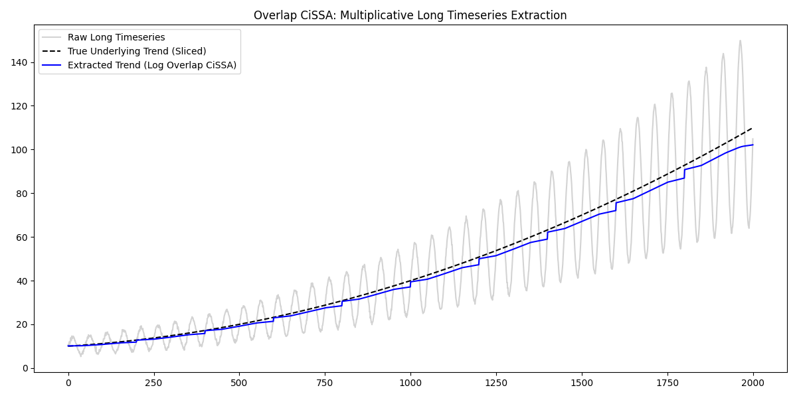

# Overlap CiSSA: Multiplicative Analysis on Long Data

This example demonstrates how to use the `MultiplicativeTransformer` in conjunction with `OverlapCissa` to correctly decompose very long time series that exhibit multiplicative seasonality.

## Why use Overlap CiSSA?
Standard CiSSA requires generating and processing a dense Circulant Matrix. For very long time series (e.g., $T > 5000$), this becomes computationally expensive and memory-intensive. `OverlapCissa` solves this by segmenting the time series into overlapping blocks, processing them individually, and stitching the valid center portions back together, completely avoiding boundary artifacts.

## Combining Overlap with Log-Transforms
If the long time series has multiplicative effects (where the amplitude of a periodic component grows over time proportional to the trend), we must apply the `MultiplicativeTransformer` to the entire dataset *before* passing it to `OverlapCissa`.

```python
from pycissa.processing.cissa.overlap_cissa import OverlapCissa
from pycissa.preprocessing import MultiplicativeTransformer

# 1. Transform the entire dataset first
transformer = MultiplicativeTransformer()
log_signal = transformer.fit_transform(raw_signal)

# 2. Configure Overlap parameters
L = 100
L_bar = L // 2   # Amount to discard from each block edge
q = 200          # Step size
Z = q + 2 * L_bar # Total block size

# 3. Run Overlap CiSSA
overlap_cissa = OverlapCissa(t, log_signal, Z=Z, q=q, L=L, L_bar=L_bar)
overlap_cissa.fit()

# 4. Group the components manually (Overlap CiSSA uses I dict)
overlap_cissa.post_group_manual(I={'trend': [0]})

# The components are stored in the results dictionary
trend_log_space = overlap_cissa.results['cissa']['manual']['rc']['trend'].flatten()

# 5. Invert the transform
trend_recovered = transformer.inverse_transform(trend_log_space, col_idx=0)
```

## Results
The raw signal features a long term, accelerating trend (quadratic) with a multiplicative seasonal cycle. By linearizing the data globally with the `MultiplicativeTransformer`, `OverlapCissa` can accurately track and extract the components block-by-block. After inversion, the extracted trend perfectly maps the true underlying curve.

*Note: `OverlapCissa` does not use autoregressive padding, so the returned timeline (`t_overlap`) and components will be slightly shorter than the input due to the discarded boundaries (`L_bar`) on the very ends.*


