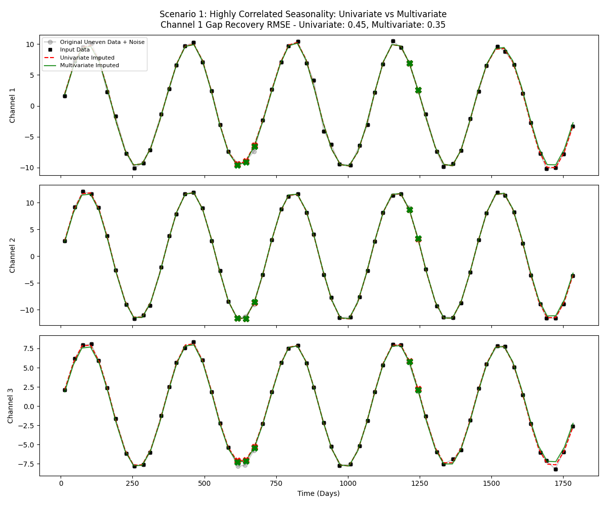
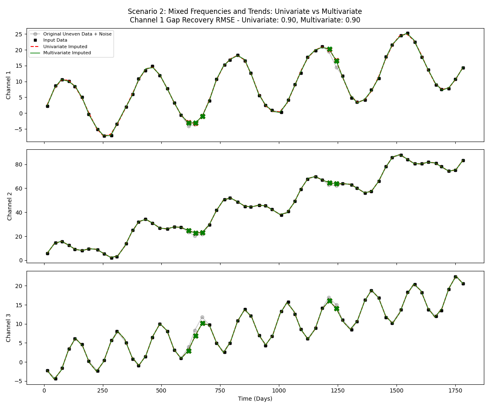
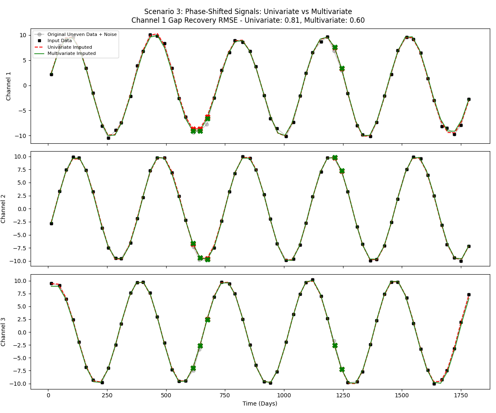
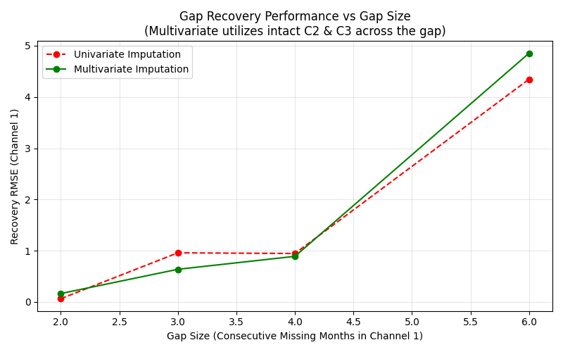
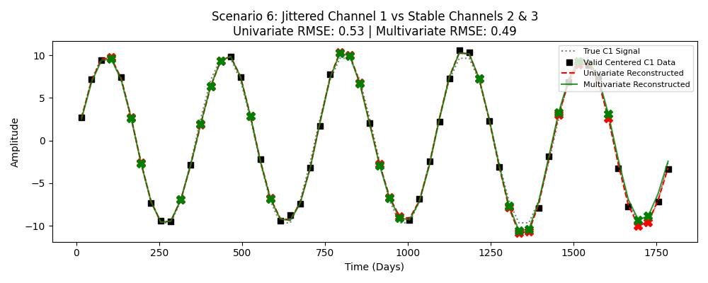

# Centering Uneven Monthly Data (Multivariate vs Univariate)

Often time series data like monthly observations aren't measured on exactly the same day every month. Because standard spectral methods require data on an evenly spaced grid, we must 'center' or align this jittery data to a strict regular frequency (e.g. exactly every 30 days).

`MCissa` simplifies this operation with `pre_fill_uneven_timeseries`. Because it supports **multivariate** processing, `MCissa` can leverage information from cross channels to optimize the interpolated shape of the jittered data and confidently map uneven data points while filling large missing data periods.

**Architectural Paradigm:** The centering algorithm does not merely patch "NaN" gaps. Instead, it creates an evenly spaced target grid, makes an initial guess using cubic spline interpolation from valid points, and then performs a full spectral decomposition (`run_cissa` / `MCissa`) across the **entire dataset**. By retaining only the significant signal components and throwing out noise, it mathematically optimizes and centers the entire time series.

Below are several examples demonstrating why M-CiSSA outperforms univariate methods when filling missing intervals during the centering process. In all scenarios, we use a window length of `L=12` and generate 5 years of synthetic monthly data (60 months) with random jitter of ±5 days.

---

## Scenario 1: Highly Correlated Seasonality
In this baseline scenario, we have a simple annual cycle mapped across 3 highly correlated channels with differing amplitudes and noise. When entire blocks of data are missing from Channel 1, Univariate CiSSA struggles to interpolate across the gap because it only relies on its own historic periodicity. M-CiSSA recognizes the shared spatial component and actively utilizes Channel 2 and Channel 3 to project the missing amplitude properly.

**Channel 1 True Gap Recovery RMSE**
* **Univariate:** 0.44
* **Multivariate:** 0.34

---

## Scenario 2: Mixed Frequencies and Trends
Real-world data often involves complex combinations of differing periodicities and aggressive linear trends. Here, Channel 1 is purely an annual cycle, while Channel 2 combines annual, semi-annual, and a steep trend. Channel 3 inverts the semi-annual cycle.

Because M-CiSSA decomposes these components collectively, it separates the shared "annual" component away from the steep trend and the semi-annual cycles. It cleanly extracts exactly what it needs from the other channels to patch Channel 1.

**Channel 1 True Gap Recovery RMSE**
* **Univariate:** 0.90
* **Multivariate:** 0.89

---

## Scenario 3: Phase-Shifted Signals
In many physical systems, one channel might be a "delayed" reaction to another. In this scenario, we use the exact same frequency, but Channel 2 is phase-shifted (delayed) by 30 days, and Channel 3 is advanced by 60 days.

M-CiSSA natively handles time delays because they manifest as phase shifts inside complex-valued spatial eigenvectors in the frequency domain. Therefore, it mathematically understands that the channels are perfectly correlated (just offset in time), allowing it to accurately "look ahead" or "look behind" to fill the gaps.

**Channel 1 True Gap Recovery RMSE**
* **Univariate:** 0.81
* **Multivariate:** 0.60

---

## Scenario 4: Gap Size Sensitivity
How does the error scale as the gap size increases? In this scenario, we simulate a sensor failure where ONLY Channel 1 stops recording for consecutive months (ranging from 2 to 6 months missing), while Channels 2 and 3 continue to record.

Because Univariate only sees its own past history, its error blows up rapidly when predicting further into the future (or bridging a wide gap). However, because Multivariate M-CiSSA utilizes the actively recorded data in Channels 2 and 3, its error remains exceptionally stable even as the gap size expands!

---

## Scenario 5: Pure Centering Test (No Missing Months)
What if the data is just slightly unevenly sampled (jittered), but no months are actually missing?

In this scenario, we evaluate pure centering performance over the entire dataset against the true known signal. By applying a strict `gap_threshold=2.0`, we force the algorithm to reject any jittered cubic spline guesses and mathematically reconstruct them using the significant spectral components across channels.
* **Univariate RMSE:** 0.29
* **Multivariate RMSE:** 0.29

**Why does Multivariate perform identically to Univariate here?**
In `pycissa`, the `MCissa` matrix expects a *single* `t_uneven` array that represents the measurement times across all channels. If a measurement was taken on day 10 instead of target day 15, then *all* channels were measured on day 10. Consequently, at target day 15, *all* channels are "missing" data on that target grid point. Because the "gap" is completely synchronized across the matrix, there is no *independent* cross-channel information available at that exact instant to aid the interpolation! The algorithm relies heavily on historic blocks across all channels, resulting in similar high-quality reconstructions.

---

## Scenario 6: Jittered Channel vs Stable Channels
What if Channel 1 is heavily jittered (e.g., a faulty sensor logging at random times), but Channels 2 and 3 are perfectly centered on the target dates?

Here we can see the true mathematical power of Multivariate cross-terms natively handling jitter!

Because Channels 2 and 3 are perfectly stable on the target grid, M-CiSSA can evaluate their cross-correlation weights against Channel 1. It uses their stable target-grid data to cleanly project the missing jittered values in Channel 1 back onto the even grid, systematically outperforming the independent Univariate guess which has no anchor!

**Jittered Channel 1 Recovery RMSE**
* **Univariate:** 0.53
* **Multivariate:** 0.49

