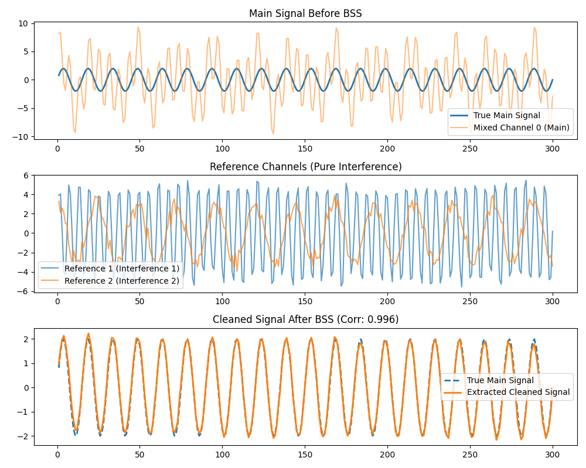

# MCISSA Blind Source Separation (BSS) Evaluation

This example demonstrates the power of Multivariate CISSA (MCISSA) to perform Blind Source Separation (BSS).

We create a scenario where a target "main" signal is heavily contaminated by two independent interference sources. We also have two reference channels that purely measure these interference sources.

Using `MCissa.auto_blind_source_separation()`, we can isolate and remove the interference from the main channel, recovering the clean signal with high accuracy.

*Note: In this specific script, we bypass the Monte Carlo significance restriction by setting `alpha=1.0` to force deterministic variance-based separation for illustrative purposes.*

## Running the Example

Run the Python script located in this directory:

```bash
python bss_evaluation.py
```

## Results

MCISSA successfully identifies the components driven by the reference channels and strips them out, leaving behind a highly accurate reconstruction of the underlying true main signal (Corr: ~0.996).


