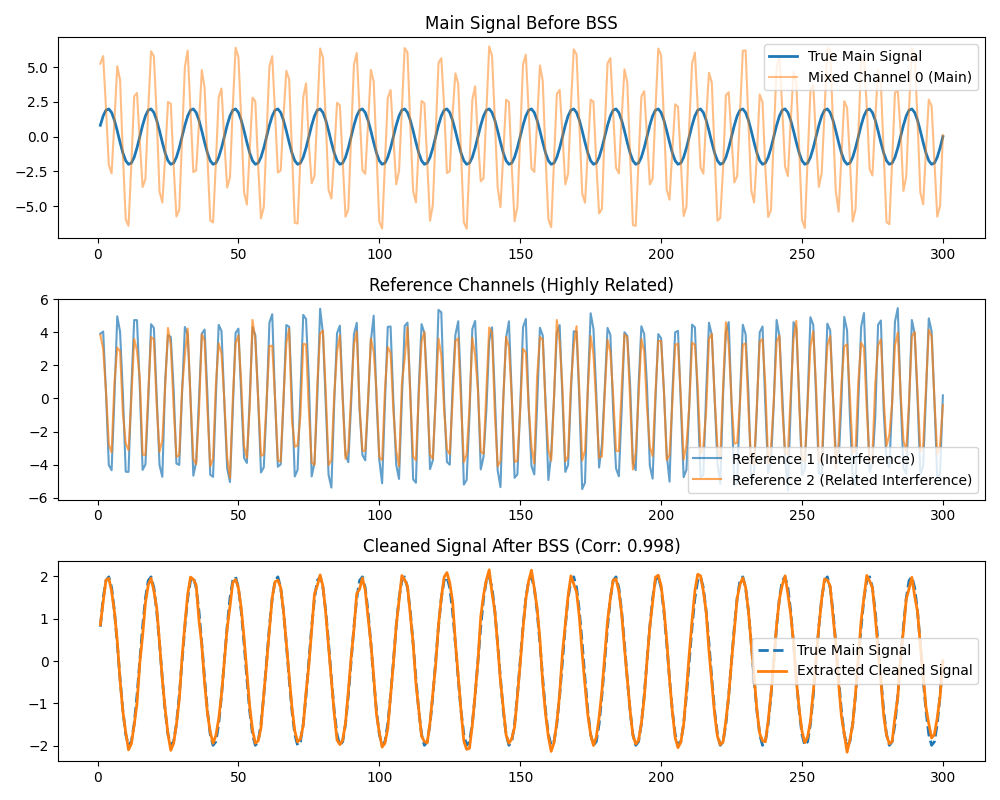

# MCISSA Blind Source Separation: Related Reference Signals

This example demonstrates how Multivariate CISSA (M-CiSSA) handles Blind Source Separation (BSS) when the provided reference signals are related (highly correlated).

## Scenario
We have a target "main" signal contaminated by an interference source.
We also have two reference channels that are highly related—they both measure the exact same interference, just with slightly different amplitudes or noise.

## How M-CiSSA Handles It
If the two reference signals are related (e.g., they share a common source or are highly correlated), M-CiSSA handles it perfectly without any issues.

Because M-CiSSA processes all channels jointly, it will naturally isolate the shared dynamics into common spatial subcomponents at specific frequencies. During the BSS process, the algorithm calculates the power of each subcomponent in the main channel and compares it against the total power in the reference channels.

If the references are related, their shared power is simply aggregated. This actually **reinforces** the detection of that shared source, making it more likely to surpass the `variance_threshold` and be successfully flagged as "influence" to be removed from the main signal.

## Running the Example

Run the Python script located in this directory:

```bash
python bss_related_references.py
```

## Results

M-CiSSA successfully aggregates the power of the related references and extracts the true main signal with high accuracy (Corr: ~0.998).


