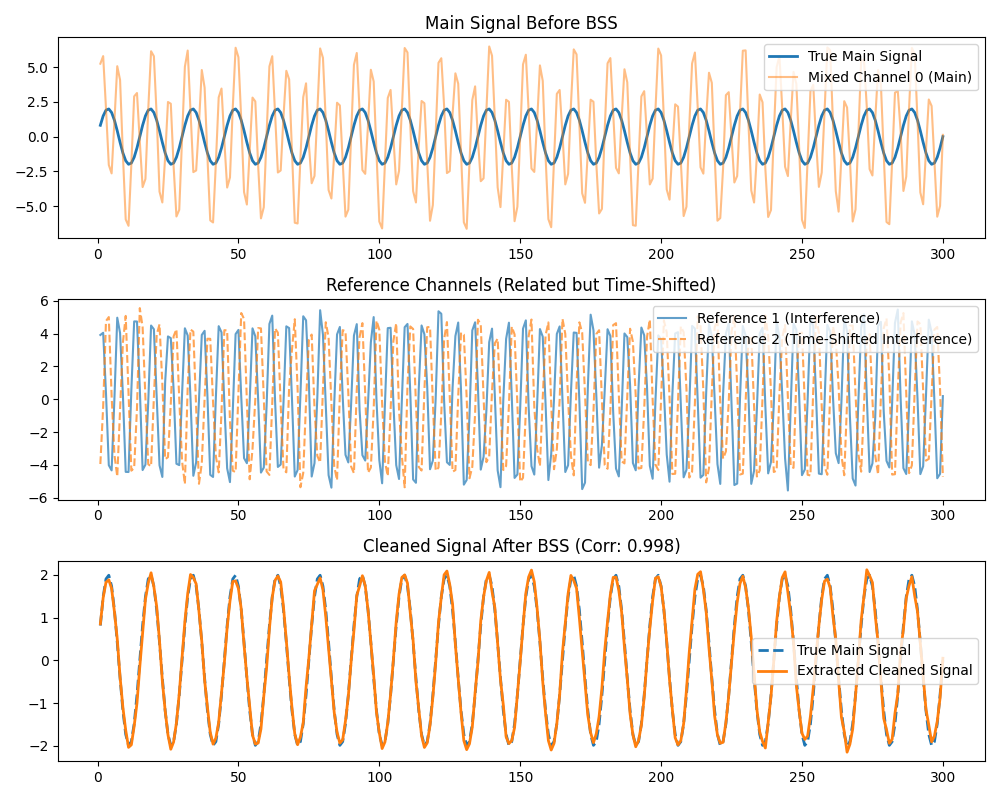

# MCISSA Blind Source Separation: Time-Shifted Reference Signals

This example explores what happens when M-CiSSA performs Blind Source Separation (BSS) using two reference signals that are related, but one is offset or time-delayed compared to the other.

## Scenario
We have a target "main" signal contaminated by an interference source.
We have two reference channels. One measures the interference directly. The second measures the exact same underlying interference, but with a noticeable time delay.

## How M-CiSSA Handles It
This scenario is where M-CiSSA truly shines compared to standard time-domain methods.

M-CiSSA operates in the frequency domain by computing the cross-spectral density matrix for all channels. A time delay (or offset) between signals in the time domain simply translates to a **phase difference** at their respective frequencies in the frequency domain.

Because M-CiSSA's spatial eigenvectors are **complex-valued**, they effortlessly capture and encode these phase differences across channels. The spatial weights adapt to the phase shift, but the overall magnitude (power/variance) of the component is preserved.

Consequently, even if one reference signal is offset from the other, M-CiSSA will still correctly identify them as the exact same underlying source. It captures the total power and successfully strips that delayed influence from your main signal as if there were no offset at all.

## Running the Example

Run the Python script located in this directory:

```bash
python bss_shifted_references.py
```

## Results

M-CiSSA transparently handles the phase difference and successfully removes the interference to reconstruct the true main signal (Corr: ~0.998).


