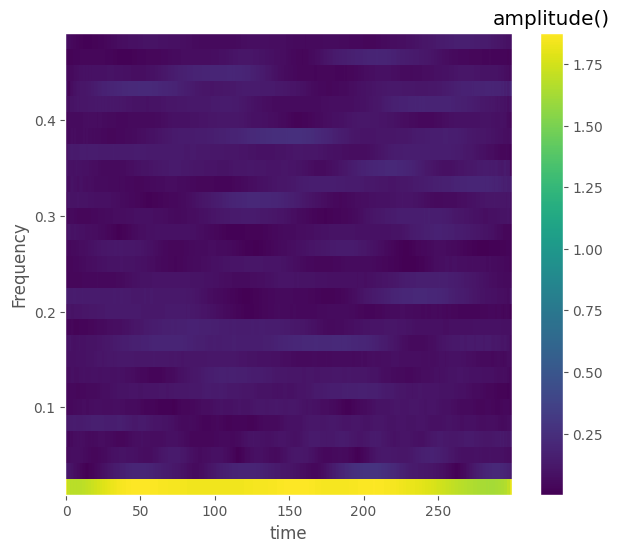
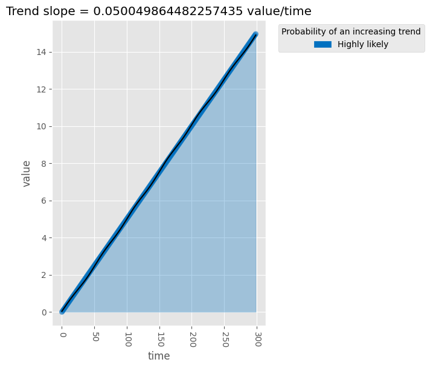
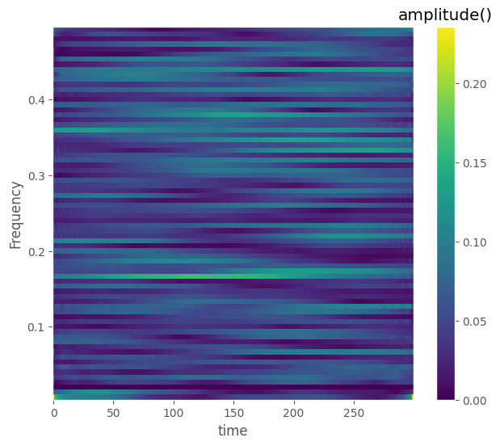
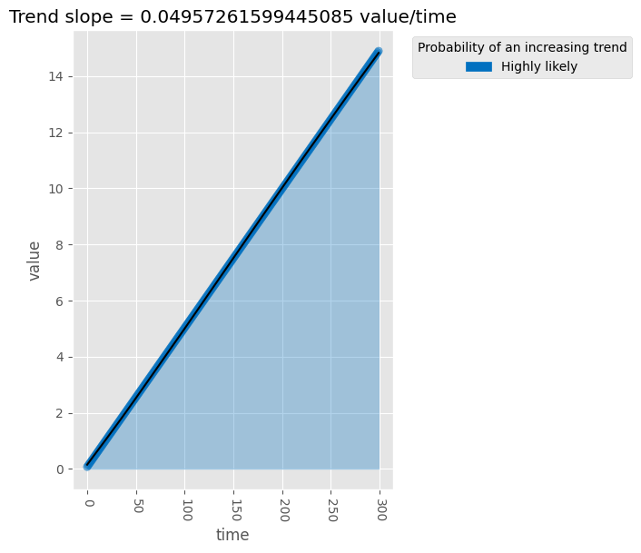
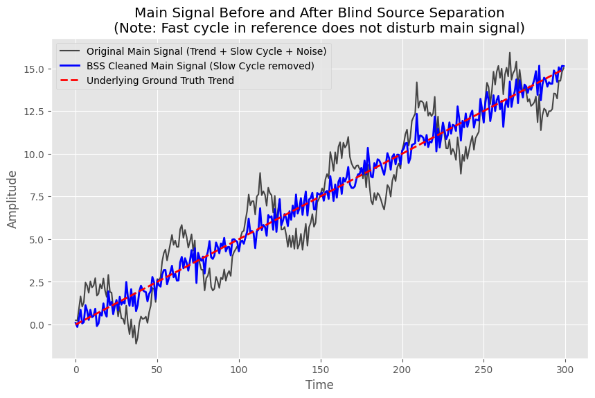
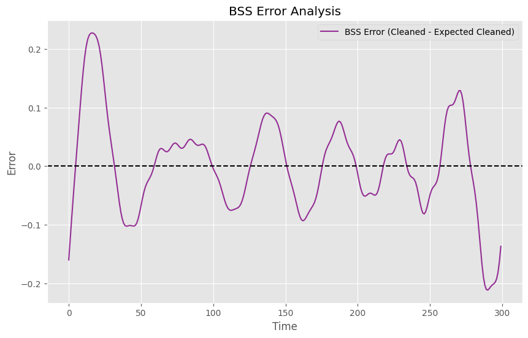

# MCissa Post-Processing and Blind Source Separation

This example demonstrates how to use the post-processing tools in Multivariate CiSSA (`MCissa`), specifically the frequency-time and trend analysis functions, and how they integrate with Blind Source Separation (BSS).

## Generating the Synthetic Data

We generate a synthetic two-channel dataset. The main channel contains a linear trend, a slow oscillation cycle, and noise. The reference channel contains the same slow cycle (phase-shifted), noise, **and a unique fast cycle**.

```python
import numpy as np
import matplotlib.pyplot as plt
from pycissa.processing.mcissa.mcissa import MCissa

np.random.seed(42)

T = 300
t = np.arange(T)

# Main channel: trend + slow cycle + noise
trend = 0.05 * t
slow_cycle = 2 * np.sin(2 * np.pi * t / 50)
main_noise = np.random.normal(0, 0.5, T)
x_main = trend + slow_cycle + main_noise

# Reference channel 1: Contains the same slow cycle + noise
# PLUS a fast cycle that is highly significant in the reference, but totally absent in the main signal
ref_cycle = 1.5 * np.sin(2 * np.pi * t / 50 + np.pi/4)
fast_cycle_only_in_ref = 3.0 * np.sin(2 * np.pi * t / 10)
x_ref1 = ref_cycle + fast_cycle_only_in_ref + np.random.normal(0, 0.5, T)

# Combine into a 2D array: (T, M)
x = np.column_stack([x_main, x_ref1])

# Fit MCissa
L = 60
mcissa = MCissa(t, x)
mcissa.fit(L)
```

## Analysis Before Blind Source Separation

First, we analyze the main channel (index 0) using the standard post-processing tools:

```python
# Group the components initially
mcissa.post_group_components(grouping_type='smallest_proportion', eigenvalue_proportion=0.9, plot_result=False)

# Frequency-Time Analysis
mcissa.post_run_frequency_time_analysis(
    data_per_period=10,
    channel_index=0,
    logplot_frequency=False,
    period_name='samples',
    t_unit='time',
    height_variable='amplitude'
)

# Trend Analysis
mcissa.post_analyse_trend(
    channel_index=0,
    trend_type='linear',
    t_unit='time',
    data_unit='value'
)
```

### Outputs (Before BSS)

The frequency-time analysis plot shows the distinct components of the main signal, including the strong cycle.


The trend plot displays the combined trend structure (including the effect of the low-frequency cycle before any filtering is done).


## Applying Blind Source Separation

We can use `auto_blind_source_separation` to filter out any signals in the main channel that are heavily driven by the reference channels. In this case, the BSS will identify the shared slow cycle and remove it from the main channel. Notice that because BSS respects M-CiSSA's spatial eigenvector separations, the highly significant fast cycle found exclusively in the reference channel is correctly identified as having 0 projection onto the main channel, preserving the main channel cleanly!

```python
mcissa.auto_blind_source_separation(main_index=0, K_surrogates=1, alpha=0.05)
```

## Analysis After Blind Source Separation

Now we can pass the `use_cleaned=True` flag to the post-processing functions. This instructs them to operate on the cleaned component representation generated by BSS, rather than the raw decomposed components.

```python
# Frequency-Time Analysis on the Cleaned Signal
mcissa.post_run_frequency_time_analysis(
    data_per_period=10,
    use_cleaned=True,
    logplot_frequency=False,
    period_name='samples',
    t_unit='time',
    height_variable='amplitude'
)

# Trend Analysis on the Cleaned Signal
mcissa.post_analyse_trend(
    use_cleaned=True,
    trend_type='linear',
    t_unit='time',
    data_unit='value'
)
```

### Outputs (After BSS)

In the updated frequency-time plot, the shared cycle has been successfully removed, leaving predominantly the residual and trend structure.


The trend analysis on the cleaned signal reveals a much smoother, linear trend structure that perfectly matches the underlying `0.05 * t` simulated trend!


### Summary Comparison

We can compare the final reconstructed main signal with the original.


### Error Analysis

We calculate the error between the BSS cleaned signal and the theoretical "ground truth" cleaned signal (which is simply the original trend plus the original noise, as the BSS is expected to remove only the slow cycle).

