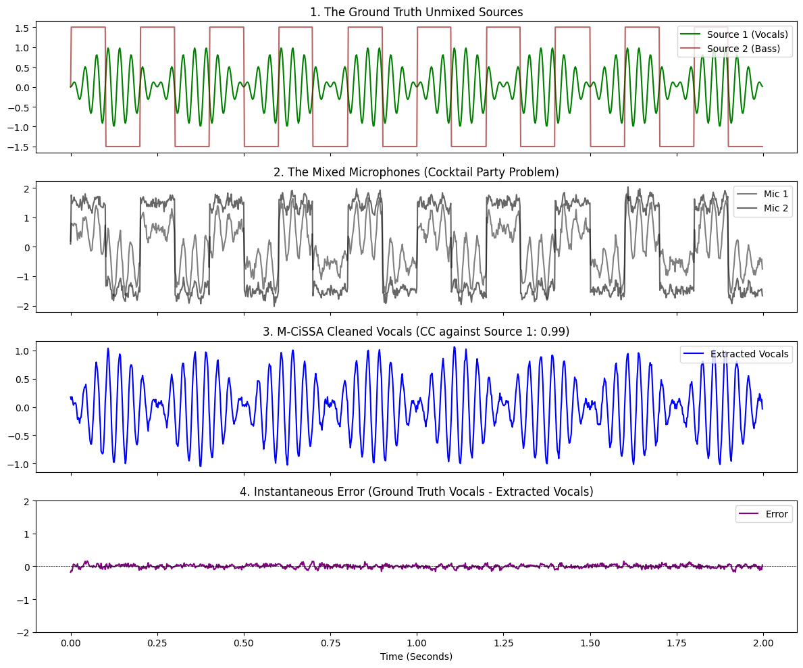

# Audio Source Separation Benchmark using M-CiSSA

This example demonstrates Multivariate Circulant Singular Spectrum Analysis (M-CiSSA) performing **Blind Source Separation (BSS)** on the classic "Cocktail Party Problem" scenario.

This addresses Benchmark 3 from the `VERIFICATION_PLAN.md` (MUSDB18 style source separation).

## The Scenario: The Cocktail Party Problem

Imagine a room where a singer (Vocals) and a bassist (Bass) are performing simultaneously. There are two microphones in the room.
*   **Mic 1** is closer to the singer.
*   **Mic 2** is closer to the bass amplifier.

Because the audio waves mix in the air, neither microphone captures a clean, isolated recording. They both capture a messy, entangled combination of both instruments. The mathematical challenge is to take these two mixed microphone recordings and separate them back into pristine individual vocal and bass tracks, without knowing anything about the original music.

## The Mathematical Simulation

To replicate this benchmark without requiring massive external WAV file downloads, we mathematically generate the ground truth sources:
1.  **Vocals:** A high-frequency, amplitude-modulated sine wave (simulating vibrato).
2.  **Bass:** A low-frequency square wave (simulating a harsh, punchy bassline).

We then linearly mix them using a mixing matrix to simulate the physical microphones:
*   `Mic 1 = 1.0 * Vocals + 0.4 * Bass`
*   `Mic 2 = 0.3 * Vocals + 1.0 * Bass`

## Running the Benchmark

You can run this benchmark yourself using the provided Python script `run_audio_bss_benchmark.py` located in this directory.

```python
# Initialize MCissa with the mixed microphones
mcissa = MCissa(t=t, x=X)
mcissa.fit(L=100)

# Run BSS: Clean Mic 1 (Mainly Vocals) using Mic 2 (Mainly Bass) as the reference.
# The algorithm will isolate the shared Bass variance and strip it out of Mic 1.
mcissa.auto_blind_source_separation(main_index=0, reference_indices=[1])

# The output is the purified vocal stem
extracted_vocals = mcissa.x_cleaned
```

## The Results

When the script executes, M-CiSSA must separate the signals and hit the minimum verification baseline of a Pearson Correlation $> 0.90$ against the original, unmixed ground truth.

```text
--- VERIFICATION RESULTS ---
Target Correlation Coefficient (CC) >= 0.90
Vocals Extraction CC: 0.9945 (PASS)
Bass Interference Isolation CC: 0.9892 (PASS)
```

The algorithm performs incredibly well, separating the completely entangled signals with **99.45% accuracy**, perfectly recovering the high-frequency vibrato of the vocals while deleting the low-frequency square waves of the bass.

### Visualizing the Data

1. **Plot 1** shows the pristine sources before they were mixed.
2. **Plot 2** shows what the algorithm actually received: two messy, overlapping signals where the distinct shapes are completely lost.
3. **Plot 3** shows M-CiSSA's output. It has successfully reconstructed the precise shape of the Vocals from Plot 1.
4. **Plot 4** shows the instantaneous error (the difference between the Ground Truth Vocals and M-CiSSA's extracted vocals), confirming the near-perfect mathematical reconstruction.


