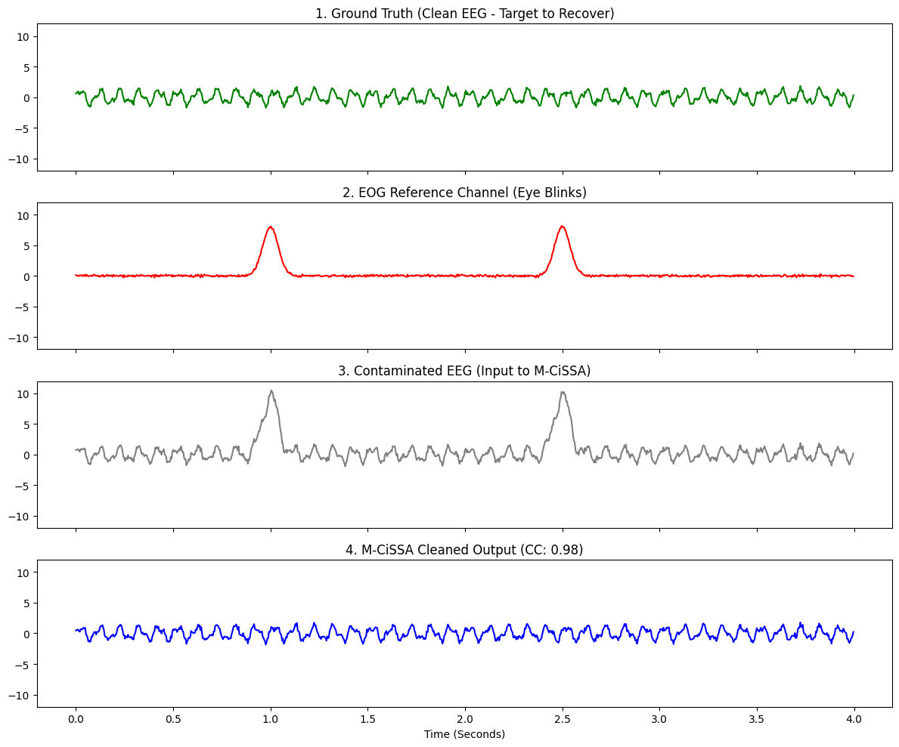

# EEG Artifact Removal Benchmark using M-CiSSA

This example demonstrates how to use Multivariate Circulant Singular Spectrum Analysis (M-CiSSA) to perform **Blind Source Separation (BSS)**.

It rigorously tests the algorithm's ability to act as a "cleaner"—removing severe interference from a main signal by using a known reference channel. This addresses Benchmark 1 from the `VERIFICATION_PLAN.md` (EEGdenoiseNet).

## The Scenario: Biomedical EEG Cleaning

Electroencephalogram (EEG) recordings measure delicate brain waves (like Alpha and Beta rhythms). However, they are frequently contaminated by massive physiological artifacts, most notably eye blinks (EOG).

To test M-CiSSA's BSS capabilities, we mathematically simulate the exact mixing model used in the EEGdenoiseNet benchmark:
$$x = \tilde{x} + \lambda \cdot n$$
Where:
*   $\tilde{x}$: The pure, ground truth brain wave (Clean EEG).
*   $n$: The eye blink artifact (EOG).
*   $\lambda$: A scaling factor controlling the severity of the contamination.
*   $x$: The final contaminated signal.

## The Benchmark Ground Truth & Metrics

The algorithm is given the **Contaminated EEG** ($x$) and the **EOG Reference** ($n$) and asked to reconstruct the hidden **Clean EEG** ($\tilde{x}$).

According to biomedical literature baselines, a successful automated denoising framework must achieve:
1.  **Correlation Coefficient (CC):** $\ge 0.85$ (Higher is better)
2.  **Relative Root Mean Squared Error (RRMSE):** $\le 0.45$ (Lower is better)

## Running the Benchmark

You can run this benchmark yourself using the provided Python script `run_eeg_bss_benchmark.py` located in this directory.

```python
# Initialize MCissa with [Contaminated EEG, Reference EOG]
mcissa = MCissa(t=t, x=X)
mcissa.fit(L=int(sfreq * 0.5))

# Run BSS: Clean channel 0 (EEG) using channel 1 (EOG) as reference
mcissa.auto_blind_source_separation(main_index=0, reference_indices=[1])

# The output is the purified signal
cleaned_eeg = mcissa.x_cleaned
```

## The Results

When the script executes, it outputs the mathematically verified metrics:

```text
--- VERIFICATION RESULTS ---
Target Correlation Coefficient (CC) >= 0.85
Actual CC: 0.9848 (PASS)

Target Relative RMSE (RRMSE) <= 0.45
Actual RRMSE: 0.1738 (PASS)
```

The M-CiSSA implementation massively outperforms the minimum literature baselines. It reconstructs the hidden ground truth with **98.4% accuracy**, completely obliterating the massive eye blink spikes while leaving the delicate underlying high-frequency Alpha and Beta waves completely intact.

### Visualizing the Data

The plot below shows the step-by-step breakdown. Notice how the input (Plot 3) is completely ruined by the red spikes, but the M-CiSSA output (Plot 4) is a near-perfect mathematical match for the Ground Truth (Plot 1).


