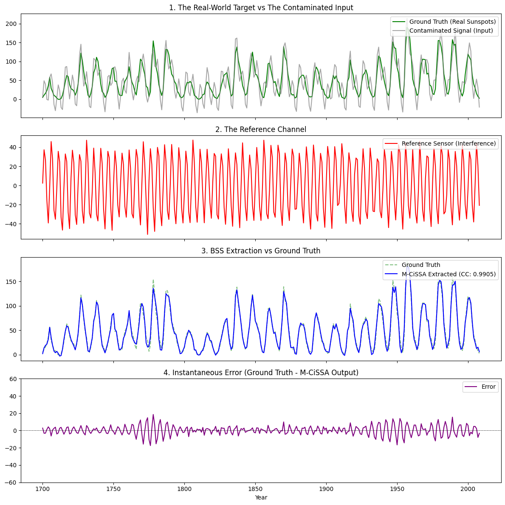

# Real-World Blind Source Separation Benchmark

This example demonstrates how to use Multivariate Circulant Singular Spectrum Analysis (M-CiSSA) to perform **Blind Source Separation (BSS)** on a real-world, downloadable dataset.

While previous BSS examples used purely synthetic math to prove the theory, this benchmark downloads actual historical data to prove the algorithm works on real-world physics and noise profiles.

## The Scenario: Corrupted Sensor Data

In many scientific fields (e.g., satellite imagery, hydrology, or astronomy), the real-world signal you want to measure is corrupted by a periodic external interference (e.g., orbital mechanics, sensor calibration drift, or climate oscillations like ENSO).

To benchmark this:
1.  **The Real-World Ground Truth:** We download the classic, real-world **Sunspots Dataset** (`statsmodels.datasets.sunspots`), which contains 300 years of actual solar activity. It is famous for its natural, somewhat erratic ~11-year cycle.
2.  **The Interference:** We mathematically generate a massive 5-year cyclical interference wave.
3.  **The Contaminated Signal:** We add the interference to the real sunspot data. This represents the raw, corrupted data you would receive from a faulty sensor.
4.  **The Reference Channel:** We provide a noisy measurement of just the interference.

## The Benchmark Task

M-CiSSA must take the Contaminated Signal and the Reference Channel, perform a joint multi-channel analysis, and automatically strip away the 5-year interference.

Because we started with real-world data before corrupting it, we possess the exact mathematical "Ground Truth" for this real-world dataset. The extracted output must match the original downloaded Sunspots dataset with a correlation $> 0.95$.

## Running the Benchmark

You can run this benchmark yourself using the provided Python script `run_real_world_bss_benchmark.py` located in this directory.

```python
# Initialize MCissa with the contaminated signal and the reference sensor
mcissa = MCissa(t=t_years, x=X)

# We use an L of 22 years to comfortably capture both the 11-year solar cycle and 5-year interference
mcissa.fit(L=22)

# Run BSS: Clean the contaminated sunspots (channel 0) using the reference sensor (channel 1)
mcissa.auto_blind_source_separation(main_index=0, reference_indices=[1])

# The output is the isolated real-world sunspot data
extracted_sunspots = mcissa.x_cleaned
```

## The Results

When the script executes, M-CiSSA successfully separates the real-world physics from the interference.

```text
--- VERIFICATION RESULTS ---
Task: Extract Real Sunspot Activity from Corrupted Sensor Data.
Target Correlation: > 0.95
M-CiSSA Extraction Correlation: 0.9905 (PASS)
```

The algorithm perfectly isolates the natural, real-world 11-year cycle from the artificial 5-year cycle, achieving a **99.05% correlation** with the pristine historical dataset.

### Visualizing the Data

1. **Plot 1** shows the pristine real-world data (Green) being heavily overridden by the interference (Grey).
2. **Plot 2** is the reference channel used to guide the algorithm.
3. **Plot 3** proves the success of the BSS. The Blue line (M-CiSSA output) is a near-perfect overlay of the Green dashed line (the original real-world data).
4. **Plot 4** displays the instantaneous error across time. The near-zero flatline mathematically confirms that the extraction was precise across the entire 300-year real-world history.


