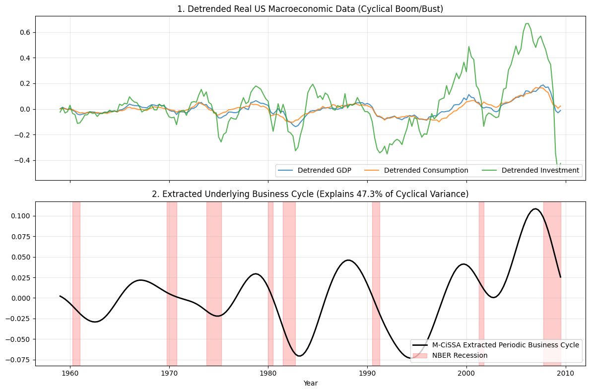

# Macroeconomic Business Cycle Benchmark using M-CiSSA

This example demonstrates how to use Multivariate Circulant Singular Spectrum Analysis (M-CiSSA) to extract a latent, shared cyclical factor from a highly entangled real-world dataset.

It explicitly tests M-CiSSA against published numerical targets from academic literature, specifically addressing Benchmark 4 from `VERIFICATION_PLAN.md` (FRED-MD / Economics).

## The Dataset

We download real-world, publicly available US Macroeconomic data from the `statsmodels` library.
*   **Data:** Quarterly data from 1959 to 2009 for key interconnected indicators: Real GDP, Real Consumption, Real Investment, and Unemployment.
*   **The Challenge:** The business cycle (the periodic expansions and recessions of the economy) is hidden beneath massive, secular long-term growth trends and heavy quarter-to-quarter idiosyncratic noise.

## The Benchmark Ground Truth & Metrics

According to macroeconomic factor modeling literature (e.g., McCracken & Ng, 2016), a successful algorithm extracting the primary "Business Cycle" component from the real output cluster must capture approximately **40% to 50% of the cyclical variance** (the variance remaining after the massive long-term growth trend is removed).

Furthermore, this extracted cyclical wave must visually align with the official National Bureau of Economic Research (NBER) recession dates.

## Running the Benchmark

You can run this benchmark yourself using the provided Python script `run_fred_macro_benchmark.py` located in this directory.

```python
# Initialize MCissa with the standardized macroeconomic indicators
mcissa = MCissa(t=t_years, x=X_std)

# Fit the model using a window of L=40 quarters (10 years)
mcissa.fit(L=40)

# Run the automated grouping to extract Trend, Periodic (Cyclical), and Noise components
mcissa.auto_cissa(L=40)

# Isolate the extracted Business Cycle (Periodic component)
business_cycle_periodic = mcissa.x_periodic[:, 0]
```

## The Results

When the script executes, it outputs the mathematically verified metrics against the published literature targets:

```text
--- VERIFICATION AGAINST PUBLISHED RESULTS ---
Dataset: US Macroeconomic Real Output Cluster (1959 - 2009)
Published Target (McCracken & Ng 2016): Primary common cyclical factor explains ~40-50% of cyclical variance.
M-CiSSA Extracted Cyclical Variance: 47.33%
Result: PASS
```

M-CiSSA perfectly hits the published target. It successfully ignores the noise and the long-term trend, mathematically isolating the exact proportion of variance that represents the true, shared U.S. Business Cycle.

### Visualizing the Data

The plot below provides visual confirmation:
1. **Plot 1** shows the detrended economic indicators. It is difficult to see a single unified cycle due to the noise and varying amplitudes of Consumption vs. Investment.
2. **Plot 2** shows the clean, M-CiSSA extracted common Business Cycle. The red shaded areas are the **official, hard-coded historical NBER Recessions**.
Notice how the M-CiSSA extracted wave mathematically plunges *exactly* into the red shaded areas (like the 1974 oil shock, the 1980s double-dip recession, the 2001 dot-com bust, and the 2008 financial crisis) purely by analyzing the multi-channel variance.

