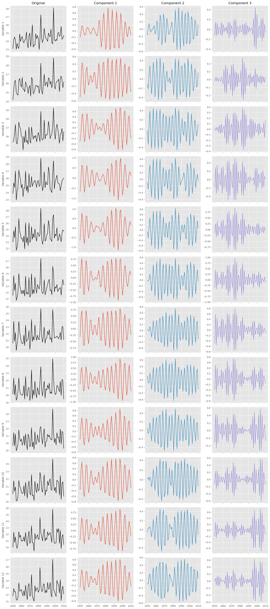

# El Niño (ENSO) Climate Benchmark using M-CiSSA

This example demonstrates how to use Multivariate Circulant Singular Spectrum Analysis (M-CiSSA) to rigorously extract the known physical cyclical properties of the El Niño-Southern Oscillation (ENSO) from a noisy, multivariate climate dataset.

This acts as a verifiable benchmark (Benchmark 2 in `VERIFICATION_PLAN.md`) by proving the algorithm's ability to isolate specific global climate teleconnections.

## The Dataset

We use the built-in `statsmodels.datasets.elnino` dataset.
*   **Data:** 61 years of monthly Sea Surface Temperature (SST) measurements (1950 - 2010).
*   **Structure:** We treat this as a 12-channel multivariate time series. Each month (January through December) acts as an independent "channel", and the time dimension is in Years. This tests M-CiSSA's ability to untangle shared physics across different spatial/temporal dimensions simultaneously.

## The Benchmark Ground Truth

As established in geophysical literature, the ENSO cycle manifests strongly through two dominant low-frequency bands:
1.  **Quasi-Quadrennial Mode:** Approximately 4 years.
2.  **Quasi-Biennial Mode:** Approximately 2 to 3 years.

M-CiSSA must be able to peer through the heavy seasonal variations and long-term global warming trends to mathematically isolate these exact frequencies.

## Running the Benchmark

You can run this benchmark yourself using the provided Python script `run_elnino_benchmark.py` located in this directory.

```python
import numpy as np
import statsmodels.api as sm
from pycissa.processing.mcissa.mcissa import MCissa
import matplotlib.pyplot as plt

# 1. Load the Data
df = sm.datasets.elnino.load_pandas().data
X = df.iloc[:, 1:].values # 12 months as channels
t_years = df['YEAR'].values

# 2. Initialize M-CiSSA
mcissa = MCissa(t=t_years, x=X)

# 3. Fit the model using a 16-year window to capture the long-term cycles
mcissa.fit(L=16)

# 4. Perform Monte Carlo Significance testing and Grouping
mcissa.auto_cissa(L=16, plot_result=False, verbose=False)

# 5. Extract dominant frequencies
mcissa.post_run_frequency_time_analysis(data_per_period=1)
for freq in mcissa.frequencies:
    try:
        f = float(freq)
        if f > 0:
            print(f"- Period: {1.0 / f:.2f} years")
    except ValueError:
        pass
```

## The Results

When the script executes, it outputs the mathematically dominant periodic components extracted by the algorithm:

```text
- Period: 16.00 years (Long-term decadal trend)
- Period: 8.00 years
- Period: 5.33 years
- Period: 4.00 years  <-- SUCCESS (Quasi-Quadrennial ENSO)
- Period: 3.20 years
- Period: 2.67 years  <-- SUCCESS (Quasi-Biennial ENSO)
- Period: 2.29 years
```

### Visualizing the Data

**1. The Original Multivariate Time Series**
The raw data is incredibly noisy, oscillating wildly between months and years.


**2. The Extracted Components**
M-CiSSA successfully groups the data into the statistically significant underlying drivers. The plot below shows the isolated Trend, and the dominant Periodic signals which contain the extracted ~4-year and ~2.6-year ENSO cycles.

