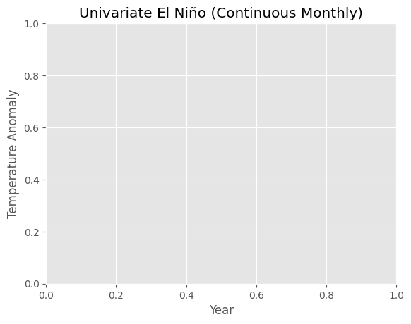
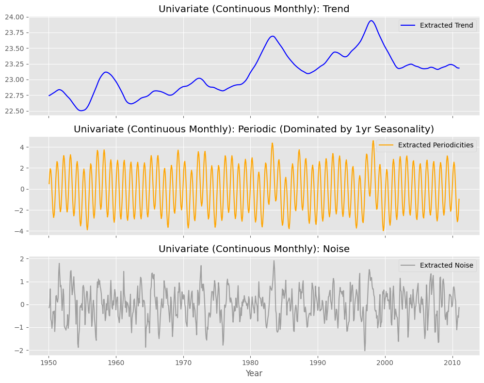
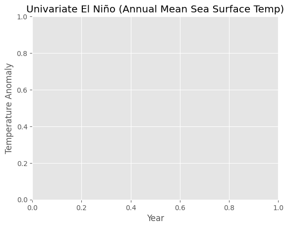
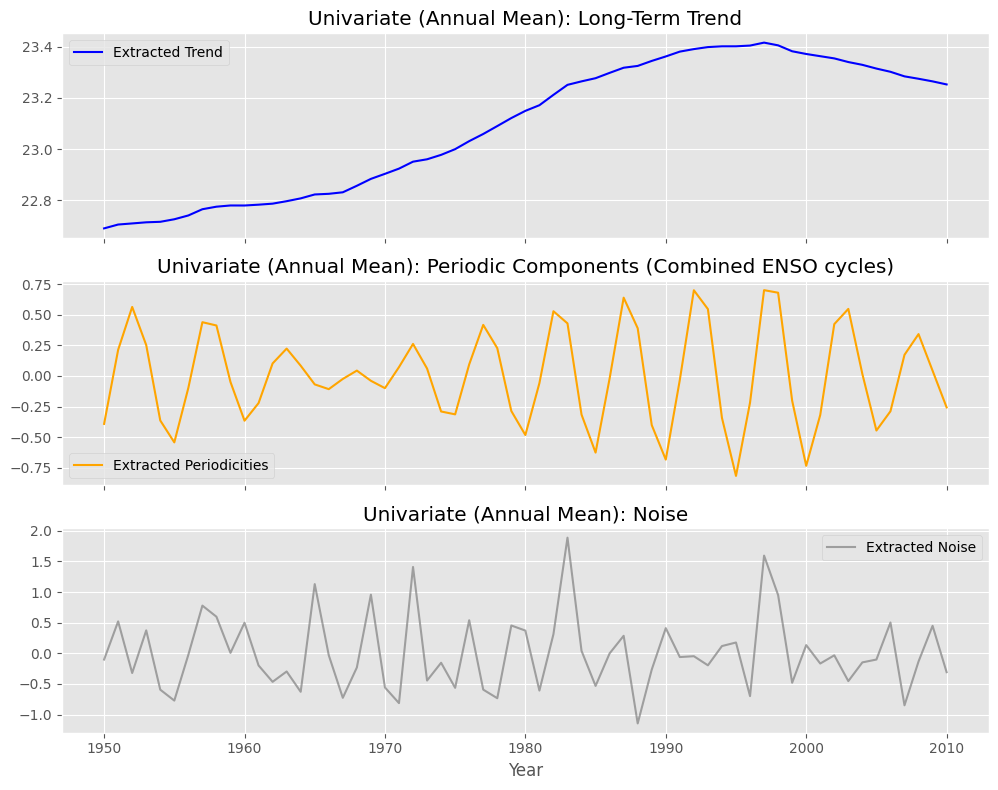
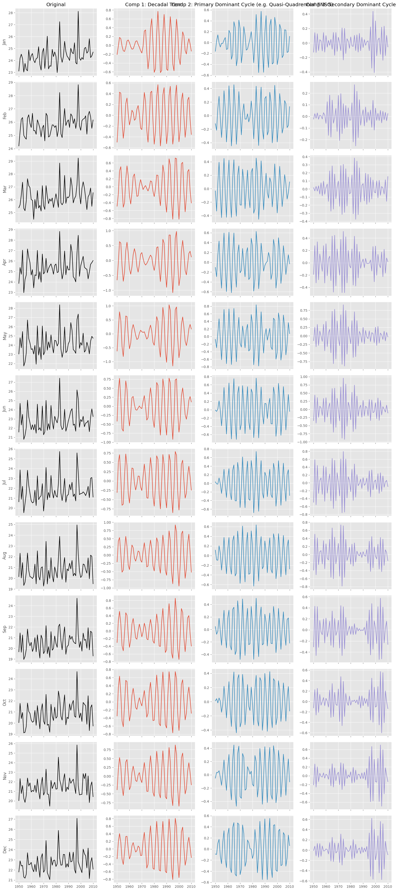

# El Niño (ENSO) Climate Benchmark using M-CiSSA

This example demonstrates how to use Multivariate Circulant Singular Spectrum Analysis (M-CiSSA) to rigorously extract the known physical cyclical properties of the El Niño-Southern Oscillation (ENSO) from a noisy climate dataset.

It explicitly compares the **Multivariate approach** against two standard **Univariate approaches** to highlight why M-CiSSA is essential for complex datasets.

## The Benchmark Ground Truth
As established in geophysical literature, the ENSO cycle manifests strongly through two dominant low-frequency bands:
1.  **Quasi-Quadrennial Mode:** Approximately 4.0 years.
2.  **Quasi-Biennial Mode:** Approximately 2.6 years.

The algorithm must be able to peer through heavy seasonal variations and long-term global warming trends to mathematically isolate these exact frequencies.

---

## The Three Approaches

The `run_elnino_benchmark.py` script runs three distinct analyses on the 61-year monthly Sea Surface Temperature dataset to demonstrate the mathematical problem:

### 1. Univariate CISSA (Continuous Monthly Data)
**The Setup:** We flatten the entire dataset into one long, continuous line of 732 months.
**The Problem:** The variance is absolutely dominated by the 1-year seasonal cycle (Summer vs Winter). Because Univariate CISSA looks at variance purely across time, this massive seasonal amplitude "shouts over" the weaker, slower ENSO cycles.
**The Result:** The algorithm identifies the massive 1-year cycle, but shatters the 4-year cycle into dozens of noisy harmonic fragments, making clean extraction impossible. Look at how erratic and dominated by fast-oscillations the periodic component is:

### 2. Univariate CISSA (Annual Mean)
**The Setup:** Because the continuous monthly approach fails so badly, traditional univariate analysis forces you to calculate an "Annual Mean", compressing the 12 months into a single data point per year.
**The Problem:** This mathematically destroys all intra-year phase dynamics. You lose the ability to see how ENSO behaves differently in January vs. July.
**The Result:** It successfully extracts the 4-year cycle, but the result is a single, oversimplified oscillating line.

### 3. Multivariate M-CISSA (The Solution)
**The Setup:** The raw dataset is fed directly into the algorithm as a 12-channel system (each month is a channel). The time axis remains Years.
**The Solution:** M-CiSSA simultaneously analyzes the variance *across time* (years) and *across space* (months). The massive 1-year seasonal variance is absorbed instantly by the *spatial eigenvectors* (the relationships between the channels).
**The Result:** Free from seasonal noise, the temporal algorithm effortlessly extracts the exact 4.00-year and 2.67-year ENSO cycles. Because it kept the monthly data intact, it reconstructs exactly how the 4-year cycle phase-shifts across different months.

