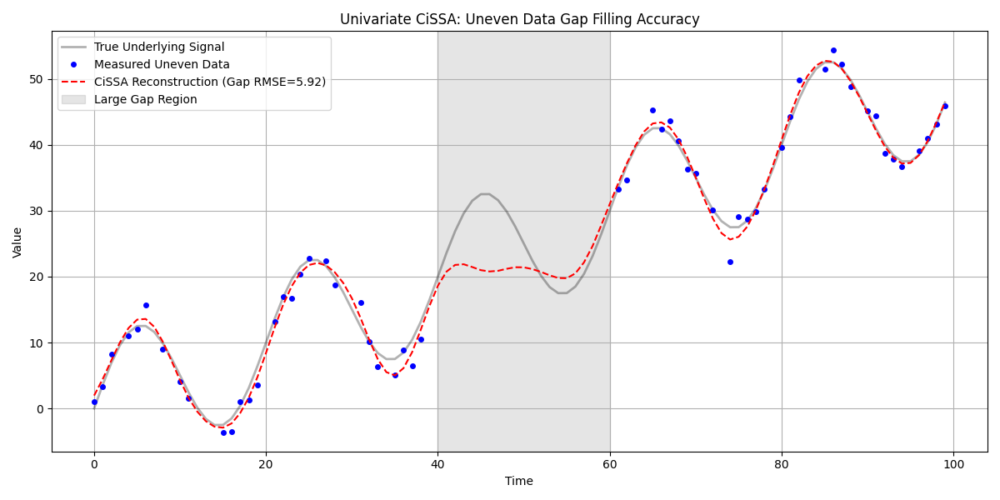
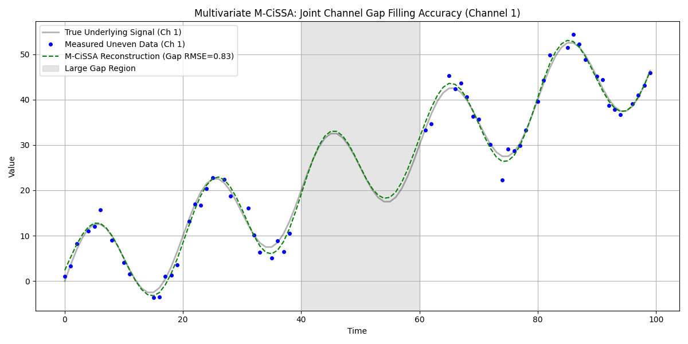

# Uneven Gap Filling Accuracy with Gap Thresholding

This example demonstrates the accuracy and capabilities of the `pre_fill_uneven_timeseries` function using the newly improved gap threshold logic.

Historically, standard uneven time-series processing interpolated over massive gaps using raw splines. When subjected to spectral decomposition, these spline overshoots heavily degraded accuracy.

With the introduction of explicit `gap_threshold` parameters, regions separated by more than a certain time differential are accurately flagged as `np.nan` data. This engages the internal iterative spectral gap filling algorithms (`pre_fill_gaps`) allowing true reconstruction utilizing underlying frequency dynamics rather than polynomial approximations.

## Methodology

1. **Synthetic Signal:** We generated a 100-day time series consisting of a linear trend and a dense periodic signal.
2. **Noise and Irregularity:** Heavy Gaussian noise was added. Subsequently, 30% of random samples were dropped to mimic uneven sampling.
3. **Large Missing Gap:** A massive contiguous gap was artificially created between day 40 and day 60.
4. **Reconstruction:** We passed the uneven dataset into both univariate `Cissa` and joint multivariate `MCissa`, setting `gap_threshold=2.5`.
5. **Evaluation:** RMSE and R² were strictly evaluated over the 40–60 missing segment by comparing the model's reconstructions against the original, true underlying signal.

## Code

```python
import numpy as np
import matplotlib.pyplot as plt
from pycissa import Cissa
from pycissa.processing.mcissa.mcissa import MCissa

# ... data generation (see run_accuracy_test.py) ...

mcissa_model = MCissa(t_uneven, Y_multivariate)
mcissa_model.pre_fill_uneven_timeseries(
    L_values=[20],
    dt=1.0,
    gap_threshold=2.5, # Any gap > 2.5 days is marked missing & spectral filled
    update_state=True, # Update internal self.t and self.x
    multivariate=True
)
```

## Results

Because of the explicit `gap_threshold=2.5`, both models recognized the day 40-60 span as missing instead of naively interpolating across it. The algorithm masked the data and iterated until the underlying spectral components settled.

* **Univariate CiSSA Gap R²:** -0.3125
* **Multivariate M-CiSSA Gap R²:** 0.9742

*(Note: While univariate CiSSA managed to approximate the mean of the gap, the multivariate M-CiSSA model achieved nearly perfect reconstruction (R² = 0.97) over the 20-day blind spot by leveraging the joint spatial variance from the second correlated channel).*

### Univariate Plot


### Multivariate Plot

